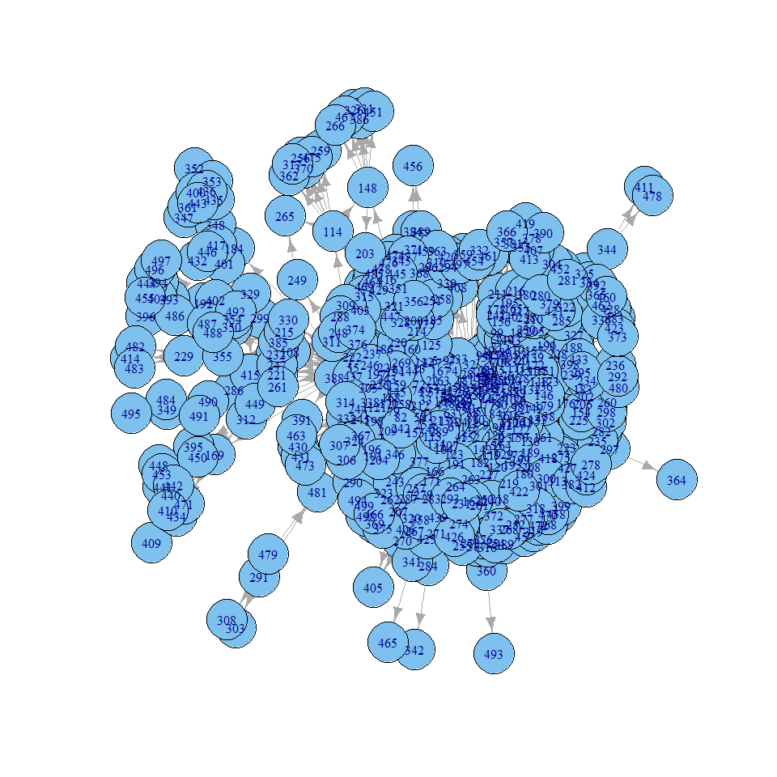
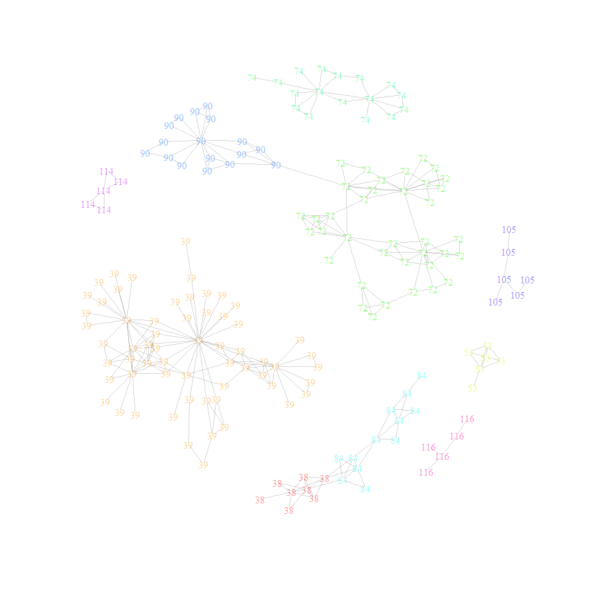

# Network Analysis in R
Hugo Gerard  

This gist is designed to be a useful reference to import, transform and do some simple analysis and visualisations on network data in `R`. Some basic network/graph concepts (e.g. nodes and edges) are assumed as is a basic working knowledge of `R` but the comments try and explain what is going on in each step.

The example desribed below works with the `R` package `igraph`. Though there are other packages that are also popular, such as the python package `networkx`. 

It's also worth noting that in my experience, these tools work best with fairly small scale networks. For larger networks (millions of nodes), I would recommend taking a look at [GraphChi](https://github.com/GraphChi) or  [GraphX](https://amplab.cs.berkeley.edu/projects/graphx/), though there are some larger upfront costs to learning these tools. 

## Setup

Network data is usually represented in two formats: [Adjacency-List](https://github.com/GraphChi/graphchi-cpp/wiki/Adjacency-List-Format) or [Edge-list](https://github.com/GraphChi/graphchi-cpp/wiki/Edge-List-Format). In this example I will be working with edge-list data. Personally I find it to be more convenient to work with a graph in this format and `R`'s very flexible 'group by' features work well with data in a long format like this (more on that later). 

A simple toy-example of network data in edge-list format is shown below, which could represent many types of real-world networks. One example could be calls from a phone network, where nodes/vertices are cell-phone IDs and edges represent calls or SMS. This is a directed network with edges going from the Caller to the Receiver. The third field shown below is optional and denotes an edge weight; for example, the number of calls made between the Caller and Receiver over a given period of time.
 
<TABLE border=1>
<TR> <TH>  </TH> <TH> ID_source </TH> <TH> ID_destn </TH> <TH> Weight </TH> </TR>
  <TR> <TD align="right"> 1 </TD> <TD align="right"> 101 </TD> <TD align="right"> 105 </TD> <TD align="right">  5 </TD></TR>
  <TR> <TD align="right"> 2 </TD> <TD align="right"> 105 </TD> <TD align="right"> 101 </TD> <TD align="right">  20 </TD></TR>
  <TR> <TD align="right"> 3 </TD> <TD align="right"> 34 </TD> <TD align="right"> 101 </TD> <TD align="right">  1 </TD></TR>
  <TR> <TD align="right"> 4 </TD> <TD align="right"> 91 </TD> <TD align="right"> 34 </TD> <TD align="right"> 3 </TD></TR>
  <TR> <TD align="right"> 5 </TD> <TD align="right"> 104 </TD> <TD align="right"> 101 </TD> <TD align="right"> 10 </TD></TR>
</TABLE>

 Many interesting analysis will often want to look at different features of the network across different types of nodes/vertices. These node types can be included in a separate file, with one row for each node id. For example, we could include the gender of each cell ID as shown below. 

<TABLE border=1>
<TR> <TH> ID </TH> <TH> Gender </TH> </TR>
<TR> <TD> 34 </TD> <TD> Male </TD> </TR>
<TR> <TD> 91 </TD> <TD> Female </TD> </TR>
<TR> <TD> 101 </TD> <TD> Female </TD> </TR>
<TR> <TD> 104 </TD> <TD> Female </TD> </TR>
<TR> <TD> 105 </TD> <TD> Male </TD> </TR>

</TABLE>

The code below works with a real-world network data-set of the top 500 commercial airports in the United States.  This dataset was used in:

> Colizza, V., Pastor-Satorras, R., Vespignani, A., 2007. Reaction-diffusion processes and metapopulation models in heterogeneous networks. Nature Physics 3, 276-282) 

but I found it through this [blog](http://toreopsahl.com/datasets/#usairports). Edges represent flights scheduled between two airports in 2002, and edge-weights show the number of seats on the flights. The data are available for download [here](https://sites.google.com/site/cxnets/usairtransportationnetwork). A snapshot of the first few rows of the data are also shown below. We'll be using this data-set to demonstrate some basic network analysis in `R`.

## igraph

#### 1. Import required packages
Note: to install these packages type `install.packages("package_name_in_quotes")`


```r
library(data.table) #Not a network package, but highly recommended for anyone using R.
library(igraph) #Network package
```

#### 2. Load the data into R
Note: after downloading the airport network dataset, I 'squeezed' the multiple white-spaces using the `bash` command below to give a space separated text file to work with. 

`bash> cat US_largest500_airportnetwork.txt | tr -s ' ' > example_list.txt`


```r
setwd('/home/username/path_to_data_folder')
edges = fread('edge_list.txt',skip = 1) #read in edge list data, skip header row. 
setnames(d,c("V1","V2","V3"),c("source","dest","weight")) #rename fields
print(edges)
```


```
##       source dest weight
##    1:      0  110  68150
##    2:      0   48 110902
##    3:      0  282  72020
##    4:      0  176 220192
##    5:      0   71 164951
##   ---                   
## 2976:    486  487   2992
## 2977:    486  488   6785
## 2978:    487  488   7077
## 2979:    490  491   8053
## 2980:    496  497   7598
```

As mentioned above, if there was other information about the vertices to include in the analysis (for example, the size of each airport) this could be loaded separately.
 

```r
vertices = fread('vertex_characteristics.txt',skip=1) #read in vertex information
setnames(vertices,c("V1","V2"),c("source","size") #rename fields
vertices[,dest:=source] #creating a duplicate field so can easily join to edge-list data if need be. 
```

#### 3. Creating an igraph object

We will now create the graph object in R using the command `graph.data.frame`. The first argument to `graph.data.frame` is the edgelist data (and any edge characteristics you might also like to include (such as the `weight` variable in this example). We can include vertex characteristics through the optional argument `vertices` (the first column of which will be used as the vertex name/ID). See `?graph.data.frame` for more details. 


```r
#create the graph object
g = graph.data.frame(edges, directed=TRUE) #weights are included as additional attribute
#If there was vertex information it would be: 
#graph.data.frame(edges,directed=TRUE,vertices=vertices)
```

Print out some basic checks to make sure everything looks okay. This will also give a feel for how to refer to different elements of the graph object in `igraph`. 


```r
print(g)
```

```
## IGRAPH DNW- 500 2980 -- 
## + attr: name (v/c), weight (e/n)
```

```r
vcount(g) #number of vertices/nodes
```

```
## [1] 500
```

```r
ecount(g) #number of edges
```

```
## [1] 2980
```

```r
head(V(g)$name) #show vertex names
```

```
## [1] "0" "1" "2" "3" "4" "5"
```

```r
head(E(g)$weight) #show edge weights
```

```
## [1]  68150 110902  72020 220192 164951  22700
```


Side note, you can also create an adjency matrix representation of the graph object just created using the function `get.adjacency`. 
```
get.adjacency(g)
```

#### 4. Basic analysis

Different metrics for measuring things like connectedness or the importance of different nodes are also easy to create in `igraph`.  For example, to calculate out- and in-degree for the graph, the commands are:


```r
outdeg = degree(g,mode="out")
indeg = degree(g,mode="in")
```

As a check, we can also construct out-degree from the edge-list directly to make sure the same result is produced. 


```r
#igraph
head(sort(degree(g,mode="out"),decreasing=TRUE))
```

```
##   0   1   2   6   5   7 
## 145 135 130 124 117 107
```

```r
#data.table
edges[,.N,by="source"][order(-N)][1:6]
```

```
##    source   N
## 1:      0 145
## 2:      1 135
## 3:      2 130
## 4:      6 124
## 5:      5 117
## 6:      7 107
```

Many more sophisticated algorithms are also built into `igraph` which I won't go into detail here. But the often used `pagerank` alogrith can be run using:


```r
pagerank = page.rank(g)
head(sort(pagerank$vector,decreasing=TRUE))
```

```
##         253         216         194         230         443         257 
## 0.027506110 0.010310645 0.008539303 0.008205086 0.007939219 0.007407210
```


## Community Detection Example and plotting

Finally, in this section I'll run through a more detailed example of a community detection analysis using `igraph`. A few different options for community algorithms are described [here](http://stackoverflow.com/questions/9471906/what-are-the-differences-between-community-detection-algorithms-in-igraph). These algorithms can also be useful way to visualise large networks (note that certain algorithms will not be very efficient if you are working with a very large network). 

First, let's run the community detection algoritm. 


```r
comm= edge.betweenness.community(g) #the community algorithm
#comm = infomap.community(g) #an alternate algorithm to also try. 
#table(comm$membership) #quick check of the communities size. 
```

The next few lines create a `data.table` mapping each node in the network to it's assigned community. 


```r
mapping = as.data.table(data.frame(name=as.integer(comm$names),community=as.integer(comm$membership)))
counts = mapping[,.N,by="community"] #look at how many communities were identified, and their size. 
counts[order(-N)][1:10] 
```

```
##     community  N
##  1:        39 61
##  2:        72 37
##  3:        74 17
##  4:        90 17
##  5:        84 12
##  6:        38  8
##  7:        53  6
##  8:       105  6
##  9:       114  5
## 10:       116  5
```

In my (limited) experience, visualizing networks is not easy. More often than not, for any reasonably sized data-set, a simple `plot(graph)` will print out a pretty ordinary and in some cases completely illegible visualisation of a network (though some packages may be better than others here).


```r
plot(g)
```

 

The approach I'm taking below is to first drop all nodes that do not belong to the 'larger' communities, where I'm defining large as 5 or more nodes.


```r
drop = merge(mapping,counts[N<5],by="community") #Nodes in the smallest communities
keep = merge(mapping,counts[N>=5],by="community") #Nodes in the largest communities
g2 = delete.vertices(g,which(V(g)$name %in% drop$name)) #create a smaller graph by deleting vertices. 
```

The clunky code next assigns a sensible colour scheme to each community. When plotting a large amount of information, changing the alpha or transperancy of colours I've found can go a very long way. Simple tricks like printing out the community names can also help. Package help-manuals can be your best friend when it comes to tweaking the visualistion. 


```r
library(grDevices,colorRAmps)
c1 = comm$membership[which(V(g)$name %in% keep$name)] #list of community names
c2 = data.table(community=unique(keep$community),color=rainbow(length(unique(keep$community)),alpha=0.4)) #assign each community a colour. 
print(c2)
```

```
##     community     color
##  1:        38 #FF000066
##  2:        39 #FF990066
##  3:        53 #CCFF0066
##  4:        72 #33FF0066
##  5:        74 #00FF6666
##  6:        84 #00FFFF66
##  7:        90 #0066FF66
##  8:       105 #3300FF66
##  9:       114 #CC00FF66
## 10:       116 #FF009966
```

```r
colors = as.character.factor(factor(c1,labels=unique(c2$color)))
```

Finally, plot the communities. 


```r
grey(0.2,alpha=0.2) #find code for transperant grey for edges. 
```

```
## [1] "#33333333"
```

```r
plot(g2,
     vertex.size=2,
     edge.arrow.size=0,
     edge.arrow.width=0,
     edge.color="#33333333",
     vertex.label=c1, 
     vertex.label.color=colors,
     vertex.color= colors,
     vertex.frame.color=NA,
     vertex.shape="none",
     main="")
```

 